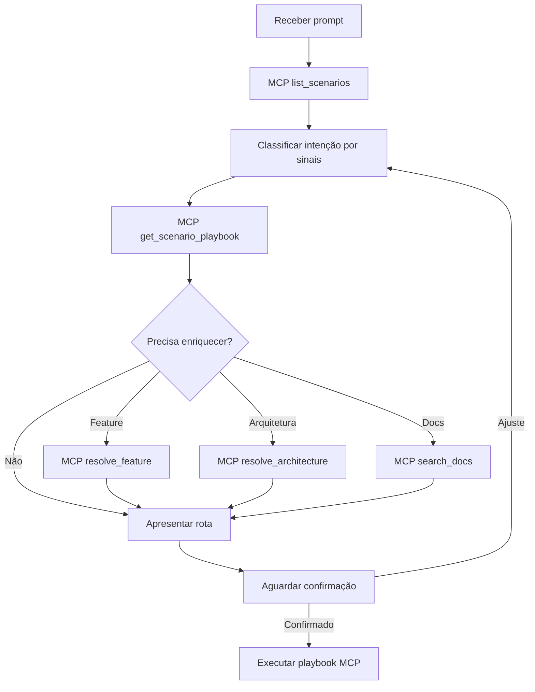

# Mvp24Hours Router

Skill de **triagem route-only** e **portável**: funciona em qualquer projeto que tenha o **Mvp24Hours MCP** configurado. Não depende de paths, manifests ou docs locais — toda rota canônica vem das tools e resources do MCP.

## Prerequisite

O servidor **Mvp24Hours MCP** deve estar disponível (stdio ou HTTP). Se não estiver configurado, informe o usuário e pare — não invente cenários nem caminhos.

Descubra o servidor pelo nome configurado em `.cursor/mcp.json` (comum: `mvp24hours`). Use `GetMcpTools` se necessário.

## When to apply

- User starts Mvp24Hours work without a clear scenario
- Request is ambiguous (create vs migrate vs add feature vs docs lookup)
- User asks "where do I start", "which path", "por onde começo", "qual caminho"
- User mentions MCP, scenarios, playbooks, or DevKit workflows

Do **not** apply when the user already named a scenario and asked to execute it.

## Workflow



### Step 1 — Bootstrap from MCP (always first)

1. `list_scenarios` — official scenario ids, titles, prompts, inputs
2. Match user intent to a candidate `scenarioId` (heuristics in [routing-matrix.md](routing-matrix.md))
3. `get_scenario_playbook` with candidate `scenarioId` — steps, tools, required inputs

Optional enrichment during triage:

- Feature in existing solution → `resolve_feature` with `featureKeyword`
- Architecture/sample choice → `resolve_architecture`, `list_samples`
- Docs/API question → `search_docs`, `get_doc`, `verify_doc_claim`
- Full manifests → resource `mvp24hours://scenarios` or `mvp24hours://capabilities`

### Step 2 — Intent heuristics (guess only)

Use the table below to pick a **candidate** `scenarioId`. Always confirm against `list_scenarios` + `get_scenario_playbook` — never trust hardcoded details.

| Signals | Candidate scenarioId | MCP prompt (from playbook) |
| --- | --- | --- |
| new API, from scratch, scaffold, greenfield | `greenfield-api` | from playbook |
| change architecture, template migration | `architecture-migration` | from playbook |
| port external code, other stack, discovery | `port-to-mvp24hours` | from playbook |
| add capability to existing solution | `add-feature` | from playbook |
| TelemetryHelper, MediatR, Swashbuckle, legacy APIs | `legacy-migration` | from playbook |
| upgrade SDK/packages, net10 | `upgrade-net10` | from playbook |
| review, compliance, checklist | `review-solution` | from playbook |
| smoke tests, WebApplicationFactory only | *(no scenario)* | MCP prompt `add-smoke-tests` |
| which architecture / which sample | *(consultation)* | `resolve_architecture`, `list_samples` |
| API/doc question | *(consultation)* | `search_docs`, `get_doc`, `verify_doc_claim` |

Disambiguation rules: [routing-matrix.md](routing-matrix.md)

### Step 3 — Present route (stop here)

Use playbook data returned by MCP — do not copy steps from memory:

```markdown
## Rota recomendada

**Intenção detectada:** [one-sentence summary]
**Cenário:** [scenarioId] — [Title from get_scenario_playbook]
**Prompt MCP:** [Prompt from get_scenario_playbook, or prompt name for standalone routes]

### Próximos passos (após sua confirmação)
1. [step.title from playbook — tool: step.tool]
2. ...

### Inputs que preciso de você
- [inputs from playbook]

Confirma que devo seguir este caminho? (ou diga o que ajustar)
```

For consultation-only routes, omit the scenario line and list MCP tools to call.

### Step 4 — Execute (after explicit confirmation only)

Follow steps from `get_scenario_playbook` or invoke the matching MCP prompt workflow. Use `verify_doc_claim` and `run_compliance_check` as the playbook specifies.

## Route-only constraints

**Do not call** until the user confirms:

- `suggest_project_structure`, `get_test_scaffold`, `run_compliance_check`
- Any file creation or code changes tied to a playbook

**May call** during triage (read-only):

- `list_scenarios`, `get_scenario_playbook`, `resolve_feature`, `resolve_architecture`
- `search_docs`, `list_samples`, `get_doc`, `find_source_symbol`
- Resources: `mvp24hours://scenarios`, `mvp24hours://capabilities`, `mvp24hours://discovery`

## MCP unavailable

If MCP tools fail or the server is not configured:

1. Tell the user the Mvp24Hours MCP DevKit is required for routing
2. Do not guess scenarios, templates, or doc paths
3. Do not reference repository files the consuming project may not have

## Anti-patterns

- Do not hardcode playbook steps — always fetch via `get_scenario_playbook`
- Do not hardcode capability lists — use `resolve_feature` or resource `mvp24hours://capabilities`
- Do not suggest MediatR, Swashbuckle, TelemetryHelper, or MultiLevelCache
- Do not execute playbook tools before user confirms the route
