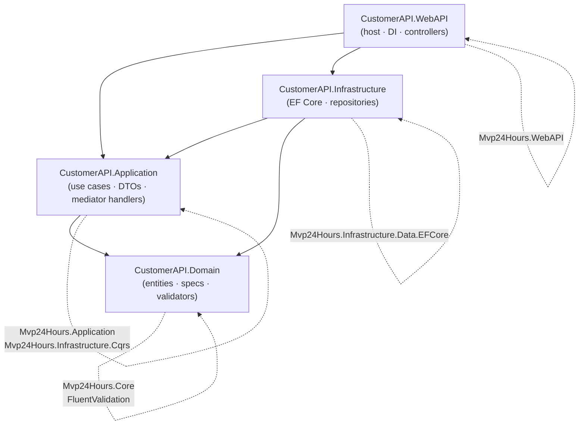

# Complex Clean Architecture — Customer API

A teaching sample that implements a full Customer + Contact CRUD API following the
**Clean Architecture** dependency rule: every arrow points inward toward the domain.

- Target: `net10.0`
- Mediator: `AddMvpMediator` (Mvp24Hours CQRS mediator)
- Persistence: Entity Framework Core + SQL Server
- Web: Native OpenAPI, ProblemDetails, Health Checks, NLog

---

## Dependency Diagram

### Mermaid



### ASCII

```
┌─────────────────────────────────────────────────────────────────────────┐
│                           CustomerAPI.WebAPI                            │
│               (host, DI wiring, controllers, NLog, OpenAPI)             │
└──────────────┬──────────────────────┬──────────────────────────────────┘
               │                      │
               ▼                      ▼
┌──────────────────────┐  ┌────────────────────────────────────────────────┐
│CustomerAPI.           │  │         CustomerAPI.Application                │
│Infrastructure         │  │  (commands, queries, handlers, DTOs, notifs)  │
│(EFDBContext, configs, │  │                                                │
│ migrations, seed)     │  │  Refs: Domain + Mvp24Hours.Application         │
│                       │  │         + Mvp24Hours.Infrastructure.Cqrs       │
│Refs: Domain           │──▶                                                │
│    + Application      │  └────────────────────┬───────────────────────────┘
│    + EFCore packages  │                        │
└───────────────────────┘                        │
                                                 ▼
                              ┌──────────────────────────────────┐
                              │       CustomerAPI.Domain          │
                              │  (entities, enums, specs,         │
                              │   domain validators, resources)   │
                              │                                   │
                              │  Refs: Mvp24Hours.Core            │
                              │      + FluentValidation           │
                              └──────────────────────────────────┘
```

**Critical rule**: `CustomerAPI.Application` has **no reference** to
`CustomerAPI.Infrastructure`. Persistence ports (`IUnitOfWorkAsync`,
`IRepositoryAsync<T>`) are provided by `Mvp24Hours.Core.Contract.Data` and
implemented at runtime by the EF Core infrastructure registered in the DI
container inside `CustomerAPI.WebAPI`.

---

## Project Structure

```
complex-clean-architecture-customer-api/
├── Complex-Clean-Architecture-CustomerAPI.sln
│
├── CustomerAPI.Domain/                    ← innermost ring (no framework deps)
│   ├── Entities/
│   │   ├── Customer.cs
│   │   └── Contact.cs
│   ├── Enums/
│   │   └── ContactType.cs
│   ├── Specifications/Customers/
│   │   ├── CustomerHasCellContactSpec.cs
│   │   ├── CustomerHasEmailContactSpec.cs
│   │   ├── CustomerHasNoContactSpec.cs
│   │   └── CustomerIsPropectSpec.cs
│   ├── Validations/Customers/
│   │   ├── CustomerValidator.cs
│   │   └── ContactValidator.cs
│   └── Resources/
│       ├── Messages.resx
│       └── Messages.Designer.cs
│
├── CustomerAPI.Application/               ← use-cases ring
│   ├── DTOs/
│   │   ├── Customers/   (CustomerCreate, CustomerUpdate, CustomerQuery,
│   │   │                 CustomerResult, CustomerIdResult)
│   │   └── Contacts/    (ContactCreate, ContactUpdate,
│   │                     ContactResult, ContactIdResult)
│   ├── Customers/
│   │   ├── Commands/CreateCustomer/  (Command + Handler + Validator)
│   │   ├── Commands/UpdateCustomer/  (Command + Handler + Validator)
│   │   ├── Commands/DeleteCustomer/  (Command + Handler + Validator)
│   │   ├── Queries/GetCustomers/     (Query + Handler)
│   │   ├── Queries/GetCustomerById/  (Query + Handler)
│   │   └── Notifications/            (CustomerCreatedNotification
│   │                                  + LogCustomerCreatedNotificationHandler)
│   └── Contacts/
│       ├── Commands/CreateContact/   (Command + Handler + Validator)
│       ├── Commands/UpdateContact/   (Command + Handler + Validator)
│       ├── Commands/DeleteContact/   (Command + Handler + Validator)
│       └── Queries/GetContactsByCustomer/ (Query + Handler)
│
├── CustomerAPI.Infrastructure/            ← EF Core adapter ring
│   ├── Data/
│   │   ├── EFDBContext.cs
│   │   └── EFDBContextSeed.cs
│   ├── Configurations/
│   │   ├── CustomerConfiguration.cs
│   │   └── ContactConfiguration.cs
│   └── Migrations/
│       ├── 20240208121708_Startup.cs
│       └── EFDBContextModelSnapshot.cs
│
└── CustomerAPI.WebAPI/                    ← outermost ring (host)
    ├── Controllers/
    │   ├── CustomerController.cs
    │   └── ContactController.cs
    ├── Extensions/
    │   └── ServiceBuilderExtensions.cs
    ├── Configuration/
    │   └── ConnectionStringsOptions.cs
    ├── Program.cs
    ├── appsettings.json
    ├── appsettings.Development.json
    └── NLog.config
```

---

## Key Clean Architecture Decisions

| Concern | Decision |
|---|---|
| **Entities** | Live in `Domain`; inherit `EntityBase<int>` from Mvp24Hours.Core |
| **DTOs / ViewModels** | Live in `Application`; implement `IMapFrom` for AutoMapper |
| **Persistence port** | `IUnitOfWorkAsync` / `IRepositoryAsync<T>` from `Mvp24Hours.Core.Contract.Data` — no EF ref in Application |
| **Use-case dispatch** | `AddMvpMediator` with command/query handlers in `Application` |
| **EF mapping** | `IEntityTypeConfiguration<T>` fluent configs in `Infrastructure` |
| **DI wiring** | Fully in `WebAPI` via `ServiceBuilderExtensions` |
| **Validation** | Domain validators (`FluentValidation`) in `Domain`; command validators in `Application` |

---

## Running Locally

1. Start a SQL Server instance (e.g., Docker):
   ```bash
   docker run -e "ACCEPT_EULA=Y" -e "SA_PASSWORD=CHANGE_ME" -p 1433:1433 -d mcr.microsoft.com/mssql/server:2022-latest
   ```
2. Update `appsettings.Development.json` with your connection string.
3. Run the WebAPI project — EF migrations are applied automatically on startup:
   ```bash
   dotnet run --project CustomerAPI.WebAPI
   ```
4. Navigate to `http://localhost:5000/openapi` for the OpenAPI UI.
5. Health check: `http://localhost:5000/hc`

---

## References

- [Clean Architecture Template](../../docs/template-clean-architecture.md)
- [Project Structure Guide](../../docs/project-structure.md)
- [Mvp24Hours Documentation](https://mvp24hours.dev)
